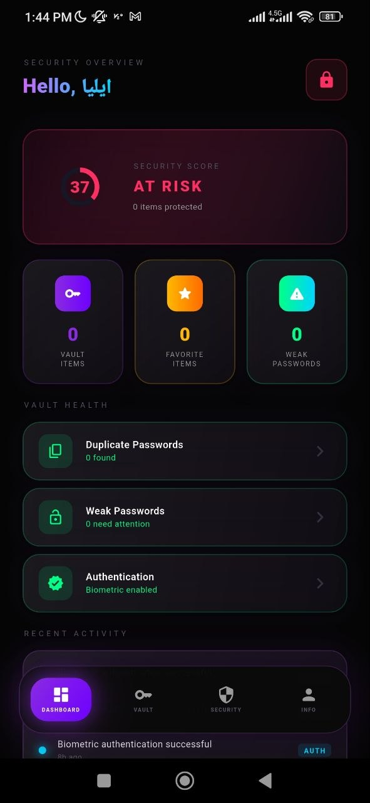
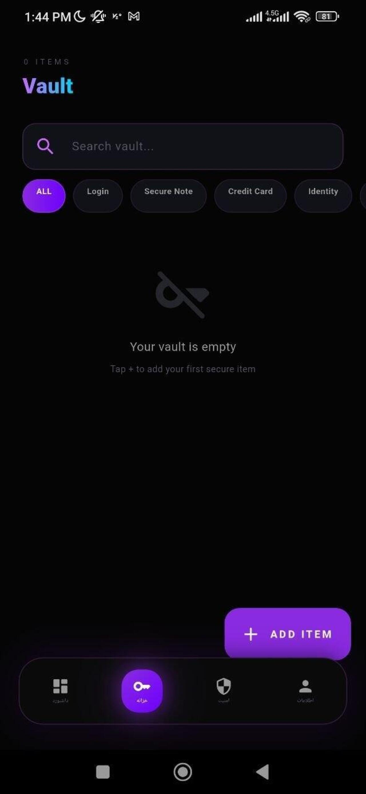
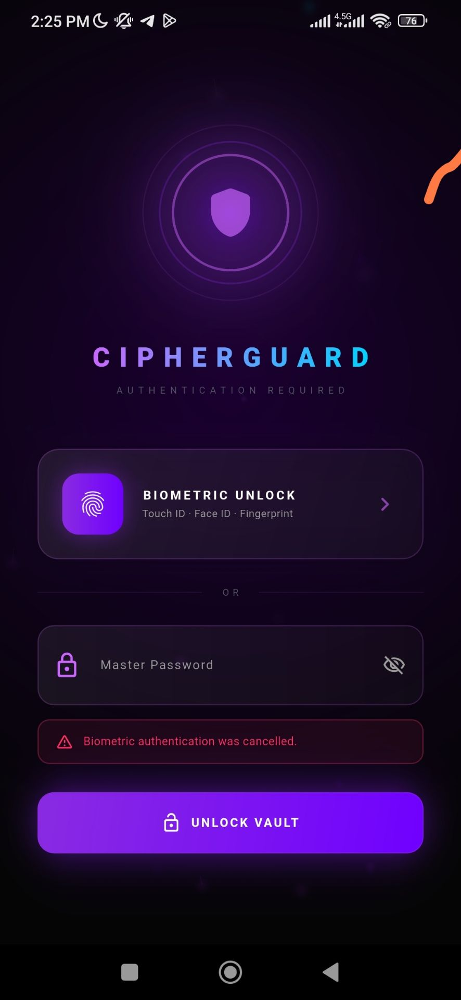

# 🛡️ CipherGuard

<div align="center">

# Secure. Store. Protect.

A modern, privacy-first password manager built with Flutter.

Keep your credentials safe, organized, and always within reach.


</div>

---

## 🔐 About

CipherGuard is a secure password manager designed to help users store, organize, and manage sensitive credentials in one protected vault.

Built with Flutter, CipherGuard delivers a fast, modern, and cross-platform experience while prioritizing user privacy and security.

---

## ✨ Features

### 🔒 Secure Password Vault

Store all your passwords in one protected location.

### ⚡ Instant Access

Quickly find and manage saved credentials.

### 🎲 Password Generator

Generate strong and unique passwords for every account.

### 👁️ Secure Viewing

Hide and reveal passwords when needed.

### 📱 Cross-Platform

Runs on Android, Windows, Linux, macOS, and Web.

### 🎨 Modern UI

Clean, responsive, and user-friendly design.

### 🔍 Search & Organization

Easily locate saved accounts and credentials.

---

## 📸 Screenshots
<div align="center">





### Welcome


</div>

---

## 🚀 Getting Started

### Clone the Repository

```bash
git clone https://github.com/V0IDNETWORK/CipherGuard.git
cd CipherGuard
```

### Install Dependencies

```bash
flutter pub get
```

### Run the Application

```bash
flutter run
```

---

## 🏗️ Built With

* Flutter
* Dart
* Material Design
* Secure Local Storage

---

## 📂 Project Structure

```text
lib/
└── main.dart
```

---

## 🎯 Future Plans

* [ ] Biometric Authentication
* [ ] Cloud Synchronization
* [ ] End-to-End Encryption
* [ ] Backup & Restore
* [ ] Browser Extension
* [ ] Password Breach Detection
* [ ] Multi-Vault Support

---

## 🔐 Security

CipherGuard is designed with privacy and security as core principles.

Users maintain full control over their stored credentials, and sensitive information should always be handled using secure storage and encryption practices.

---

## 🤝 Contributing

Contributions, bug reports, and feature requests are welcome.

Feel free to fork the project and submit a pull request.

---

## 📜 License

This project is licensed under the MIT License.

---

<div align="center">

### Developed by V0IDNETWORK

⭐ Star this repository if you find it useful.

</div>
